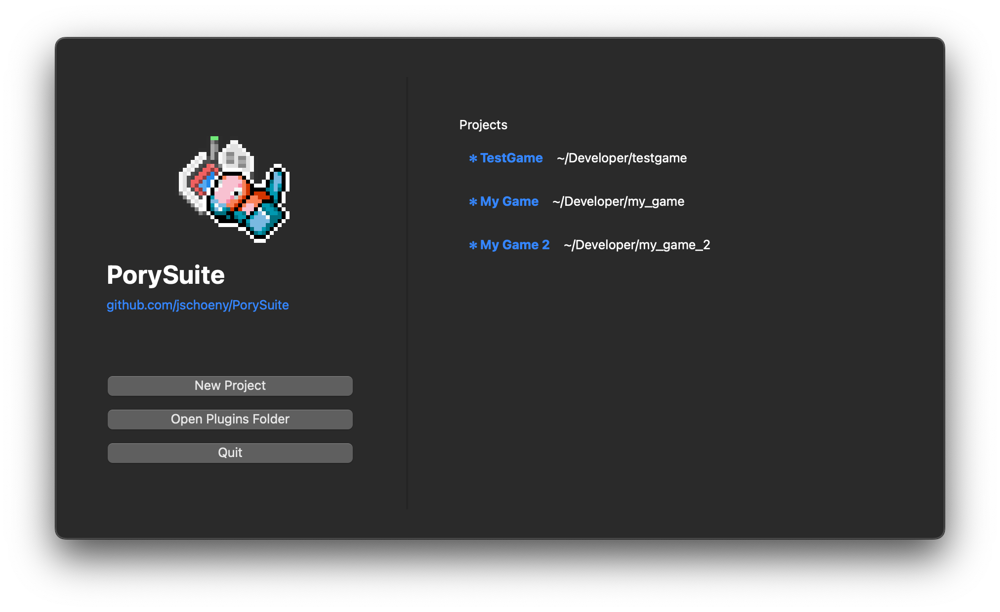
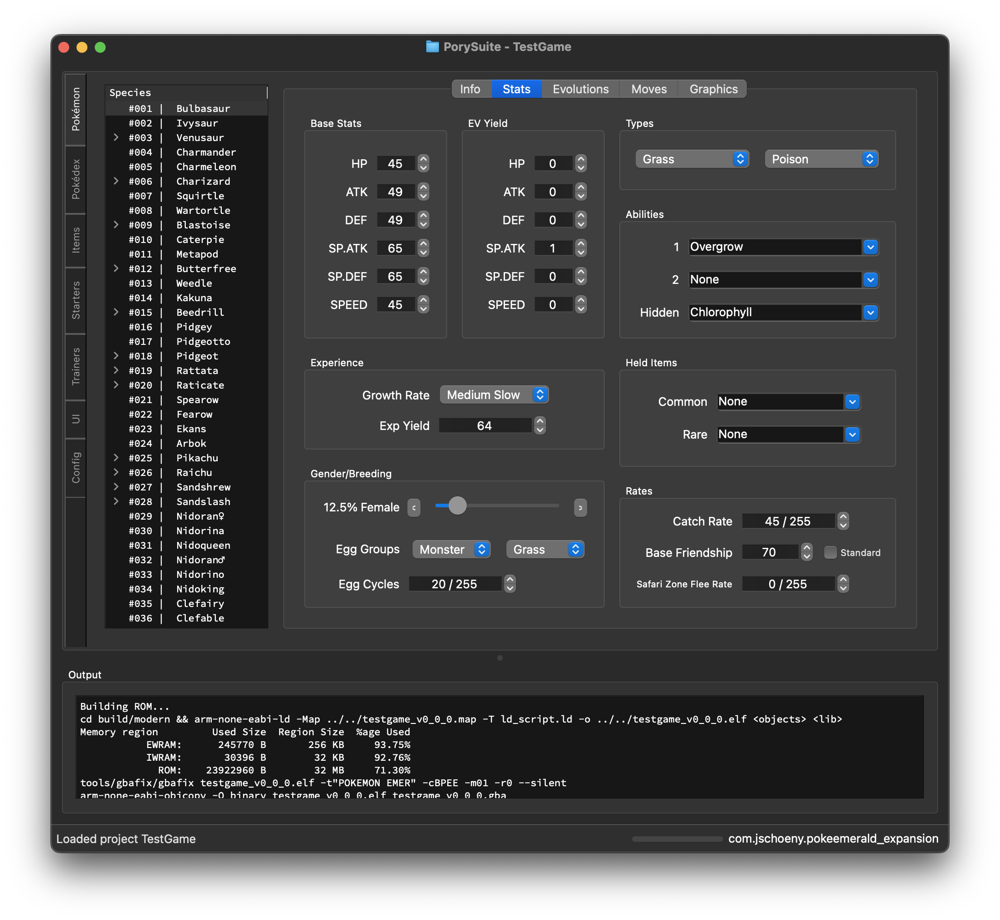

---
This repository is an updated fork of PorySuite that runs exclusively on PyQt6.
This README must remain accurate. Whenever changes are made to the project,
update both this file and `AGENTS.md` so users always have correct
instructions.

PorySuite always writes changes back into the original FireRed sources. It never generates new data or header files such as replacement learnset tables or item definitions. If a file is missing, rebuild it from the game's canonical headers instead of expecting the editor to fabricate a stand-in. In particular, the editor does not create `include/constants/hoenn_dex.h` or any other non‑vanilla headers.

We also never roll back tracked files unless a maintainer explicitly approves that exact file through a multi-step confirmation. Work forward within the current tree so previously captured progress is preserved.

Format Fidelity & Missing Sources
---------------------------------
- Edits must be read from the canonical sources (`src/` and `include/`) and saved back to those exact files in their native formats to keep `make` builds stable.
- The editor preserves on-disk formats and layouts: JSON shape is kept as-is (dict/list/"items" wrapper), and headers are patched in place without changing structure.
- If any required canonical file for the active action is missing or unreadable, the app shows a blocking message and aborts the operation without writing anything. This includes Items headers (`src/data/items.h` or legacy `src/data/graphics/items.h`).
- Cache regeneration remains available via Tools for missing `src/data/*.json` files, but save/write-back operations never proceed when their required canonical sources are missing.

Formatting‑Preserving Write‑Back (FireRed)
-----------------------------------------
- Items: The write‑back modifies only the right‑hand side of `.field = value` within existing `[ITEM_*]` blocks and preserves whitespace, comments, field order, and blank lines. New fields/blocks copy local indentation and comma rules. Legacy minimal headers are handled without reflow; unknown layouts abort.
- Learnsets: Species learnsets (level/TM/HM/tutor/egg) are patched in place in their canonical headers. Only the species’ entries are changed; comments/spacing are preserved; additions/removals copy local formatting; ambiguous structures abort safely.
- Abilities: For FireRed, abilities write‑back is disabled. The editor never rewrites `include/constants/abilities.h`; `ABILITIES_COUNT` and the closing `#endif` remain intact.
- Non‑canonical overlays (e.g., `pory_species.h`) are not used or created.
- Pokédex header: `include/constants/pokedex.h` is updated via an in‑place patcher that touches only the `NATIONAL_DEX` enum body (order/entries). All other content (includes, macros like `KANTO_DEX_COUNT`, comments, blank lines) remains byte‑for‑byte identical. If the enum cannot be uniquely located or the layout is ambiguous, the save aborts with a blocking message and no files are changed.

Asset Cloning Prompts (New Species/Items)
-----------------------------------------
- When you add a new species or item (in memory), saving now prompts you to select an existing template to copy graphics from.
- Species: choose a source species; the editor clones `graphics/pokemon/<source>` to `graphics/pokemon/<new>` following vanilla naming/slug rules.
- Items: choose a source item; the editor clones matching files/folders under `graphics/items/` to new names.
- After copying, a dialog lists all created asset files so you can edit them manually (replace placeholders).
- No headers or data files are created by this step—only images under `graphics/**` are added, and only with your explicit confirmation.

Current Status
--------------
- The editor is hardwired for pokefirered. Emerald support may come in a future alternate version.
- Most save operations now use direct header writers that bypass the old plugin pipeline's broken ReadSourceFile/WriteSourceFile wrappers. Species stats, pokedex entries, learnsets (level-up, TM/HM, tutor, egg), and items all write directly to C headers on Save.
- Trainer data and battle move definitions still use the old pipeline's `parse_to_c_code` for header writes.
- Scroll wheel protection is installed app-wide — combo boxes and spin boxes only respond to the scroll wheel after being clicked.

# PorySuitePyQT6
An extensible toolkit for Pokémon decomp projects.

The toolkit now ships with a FireRed plugin targeting the official
[pokefirered](https://github.com/pret/pokefirered) repository.

This repository includes a copy of that repo in a `pokefirered/` folder as a
reference for plugin development. Treat it as **read-only**—future releases will
omit this folder so projects should rely on their own `pokefirered/` directory.

See [CHANGELOG.md](CHANGELOG.md) for a summary of recent plugin updates.

**NOTE: This project is still in alpha. It is not a finished product and will not always behave as expected. _Not all data will be modifiable in the UI._**

One of the biggest roadblocks for first-time ROM hackers wanting to use the decomps ([pokeemerald](https://github.com/pret/pokeemerald), [pokeemerald-expansion](https://github.com/rh-hideout/pokeemerald-expansion), [pokefirered](https://github.com/pret/pokefirered), [pokeruby](https://github.com/pret/pokeruby)) is the initial setup process.

_See pokeemerald's [INSTALL.md](https://github.com/pret/pokeemerald/blob/master/INSTALL.md) to see why it can be a bit daunting._

PorySuite aims to make this process as easy as possible by providing a single tool that can handle all of that setup for you. The application now runs directly on your machine without relying on Docker.

This program also aims to provide a user-friendly interface for adding features and modifying data in the decomp projects.

The Pokédex tab now supports drag‑and‑drop reordering. Saving updates `pokedex.json`,
species numbers and patches `include/constants/pokedex.h` in place (NATIONAL_DEX enum only) while preserving the rest of the file.
Selecting a species in the tree updates the Pokdex lists and description.
Editing the Info tab’s `category` and `description` persists to JSON and also
rewrites the engine sources so the game reflects your edits:
- Updates `.categoryName` in `src/data/pokemon/pokedex_entries.h`.
- Updates localized Pokédex text in `src/data/pokemon/pokedex_text_fr.h`.
No fictional headers are introduced — the plugin never creates `pory_text.h` or `hoenn_dex.h`.
Saving no longer reverts the Info tab description: the app saves the current
species before refreshing the view, and those edits persist across sessions.
If the save workflow previews header writebacks, selecting No cancels the save and leaves disk files untouched so you can keep editing in-memory.
Save previews now list only headers that already exist on disk; missing FireRed sources are skipped instead of being generated.
PorySuite auto-detects the existing learnset headers (searching alternative FireRed paths) so write-backs always target the real files in your project tree.
The resolved FireRed headers are the canonical ones from pret/pokefirered:
- `src/data/level_up_learnset_pointers.h`
- `src/data/level_up_learnsets.h`
- `src/data/tmhm_learnsets.h`
- `src/data/tutor_learnsets.h`
- `src/data/egg_moves.h`
If your fork relocates them, PorySuite searches the tree and only writes to files that actually exist; anything missing is skipped and logged.
All console stdout/stderr (including launch scripts) now streams into the Output panel so the UI mirrors the command window.
The Pokédex description field now enforces the per‑line character limit detected
from `pokedex_text_fr.h` (typically 42) and the text box width matches that
limit so what you type is exactly what gets written.
Sprites and icons now load robustly:
- If ``species_graphics.json`` is available, it maps graphics constants
  to PNG paths.
- When a mapping is missing, the plugin derives the expected graphics
  constant from the selected species.
- If caches are absent entirely, it also falls back to the conventional
  layout ``graphics/pokemon/<species>/{front,back,icon,footprint}.png`` so
  the Graphics tab still renders without prebuilt caches.
- The second front-facing slot shows a shiny variant generated on the fly by
  applying ``shiny.pal`` to ``front.png`` (with ``normal.pal`` as the base).
  The synthesized PNG is stored under
  ``<project>/temp/porysuite/shiny/<species>/front_shiny.png``.
Missing PNGs log ``Image file for <NAME> not found: /path/to/file.png``; unreadable
PNG files log ``Failed to load image file /path/to/file.png for NAME``. On success,
the final file URL is logged at debug level. Image paths are normalized so Windows
backslashes become forward slashes in logs and Qt URLs.
Switching between the Pokémon data sub-tabs now refreshes the current
species so the Graphics pane repaints after saving.
Selecting a Pokémon in the tree also refreshes the active sub-tab, so you no
longer need to visit the Pokédex tab first when browsing different species.
The Items tab lists every item so you can edit names, prices, and hold effects directly. The extractor keeps `src/data/items.json` as the primary source and preserves whatever structure it originally used (dictionary, list, or an `"items"` wrapper). When caches are missing it now parses the real headers -- `src/data/items.h` when present, otherwise `src/data/graphics/items.h` -- using a brace-balanced scanner that tolerates nested structs, comments, and multi-line fields. If neither header exists the table logs a warning and stays empty until the project provides one; it never invents placeholder files. Saving rewrites the entry back into the existing JSON shape and updates the live header in place so renames propagate to the real sources without creating new files. The automated `parse_to_c_code` flow still needs attention (see the failing write-back tests), so validate with `pytest` after editing items.

The Pokemon > Moves sub-tab now lists only the moves the selected species can learn. Edit the method for each move—such as the level learned or TM number—and the table refreshes automatically when you switch species while keeping pending rows in memory until you save.
Use the Reset button to discard unsaved edits and reload the last loaded data for the current species no matter which Pokemon sub-tab you are on.
Add or remove learnset entries with the buttons below the table; the move column now shows a dropdown of every move in the project, and the method/value columns provide appropriate editors (level spin box, TM/HM lists, etc.) so the data stays valid.
The standalone **Moves** main tab exposes global move definitions with a live search/filter bar (searches by constant, effect, or type), an **Effect** column, a **Priority** column, and sortable column headers. Click any header to sort; use the search bar to narrow the list instantly.
Use the **Add Move** button to create a new move from scratch, or **Duplicate Move** to copy the currently selected move's stats, flags, description, and animation into a new entry. A dialog prompts for the new constant name (e.g. `MOVE_SHADOW_RUSH`) and in-game display name (e.g. `SHADOW RUSH`). On Save, PorySuite writes all five required files so the new move compiles immediately: `include/constants/moves.h` (constant + MOVES_COUNT), `src/data/battle_moves.h` (struct entry), `src/data/text/move_names.h` (display name), `src/move_descriptions.c` (description text + pointer), and `data/battle_anim_scripts.s` (animation table entry — reuses an existing animation by default).
The **Animation** field on the move detail panel shows which battle animation plays when the move is used. This is separate from the Effect (battle behavior). You can reassign any move to reuse an existing animation from the dropdown.
Species learnsets rebuild on the fly from `level_up_learnsets.h`, `tmhm_learnsets.h`, `tutor_learnsets.h`, and `egg_moves.h` whenever `moves.json` lacks `species_moves`, so fresh or cacheless projects still populate the per-species table.
The **Tutor** sub-tab uses the same Add/Remove table pattern as the Egg Moves tab — any move can be added via dropdown rather than being limited to a pre-discovered checkbox list.
TM, HM, tutor, and egg entries now appear automatically after a rebuild, matching the available learnsets in the FireRed headers.
Saved learnsets are automatically ordered so LEVEL, TM, HM, tutor, and egg entries match the structure of the vanilla FireRed data.

### Saving & Resetting
- The application never writes changes automatically: every edit stays in memory until you choose **File > Save** (or confirm the save prompt when exiting). Saving writes the currently active species before the UI refreshes so description, stat, and learnset edits persist on disk.
- The ↻ Reset button on the Pokémon tab only restores the last loaded state for the selected species. It does **not** download vanilla data; it simply discards unsaved edits in memory.
- After experimenting with moves or other attributes, use Reset to undo temporary changes, then save once you are satisfied.
If your `items.json` contains an `"items"` array or a list of entries, the
plugin converts it into a dictionary automatically when the project loads so
older files do not crash the editor.
The Evolutions tab now lets you add or remove rows for the selected Pokémon.
Evolution data is cached in `src/data/evolutions.json`. If this file does not
exist the plugin parses `src/data/pokemon/evolution.h` to rebuild it so projects
always start with the latest lists. Saving writes the updated data back to
`evolutions.json` when present, otherwise it falls back to `species.json`.
Switching to another Pokémon reloads its stored evolutions so you always see the
current rows. Evolution method names are parsed from `pokemon.h` so each
dropdown shows a readable label. The tree items also store the method constant
as user data so editing parameters keeps the underlying value intact.
Item-based evolution methods (`EVO_ITEM`, `EVO_TRADE_ITEM`) show an item dropdown for the parameter instead of a plain text box. Trade and Friendship methods disable the parameter field automatically.
Saving stats or evolutions now regenerates `species_info.h` and `evolution.h`
immediately so changes persist in your project source.
Pokédex category/description edits likewise update `pokedex_entries.h` and
`pokedex_text_fr.h` on Save.

Flags (FireRed)
- No Flip: sets `species_info.noFlip = TRUE/FALSE` in `species_info.h`.
- Genderless: sets `genderRatio = 255` in `species_info.h`.
- Egg Group: Undiscovered: writes `eggGroups = [EGG_GROUP_UNDISCOVERED, ...]`.
- Starter: toggles membership in `src/data/starters.json`.
- In National/Regional Dex: shown but read‑only; they mirror the header (`include/constants/pokedex.h`).
  - National ordering is the `NATIONAL_DEX` enum.
  - Regional membership is determined by `KANTO_DEX_COUNT` in the header.
If new methods fail to appear, delete `src/data/constants.json` or choose **Tools > Rebuild Caches**. The editor recreates this file automatically when the `types` or `evolution_types` sections are missing.

`PokemonConstants` are now loaded before evolutions so type and method lists
appear immediately when the project opens.




## Contributing


## Flags editing and save behaviour

- Flags: PorySuite exposes `species_flags` when the active plugin/repo provides them (e.g., pokeemerald). For targets that do not expose `species_flags` (such as the bundled PokéFirered reference), the app synthesizes a small, safe set of editable flags from existing in-repo fields: Legendary (proxy for unbreedable), Unbreedable (sets egg group to `EGG_GROUP_UNDISCOVERED`), Genderless (sets `genderRatio` to 255), No Flip (sets `noFlip`), and Starter (toggles membership in `src/data/starters.json`).

- Edits are kept in memory and do not modify repository files until you explicitly save (`File > Save` or the save prompt shown when closing). Browsing and editing in the UI will not write `species.json`, `evolutions.json` or other source files until you confirm Save.
Contributions are more than welcome! If you have an idea for a feature or a bug fix, feel free to open an issue or a pull request.

### Quick Start (Windows)

1. Install [Python 3.12+](https://www.python.org/downloads/) and then install the dependencies:
   ```bash
   pip install -r requirements.txt
   ```
   This installs `PyQt6`, `platformdirs`, `Unidecode` and `typing_extensions`.
2. Build your game project once so `src/data/graphics/items.h` exists. PorySuite relies on
   this header to populate the Items tab.
3. Double click `LaunchPorySuite.bat` to start the application.

The repository already includes generated `resources_rc.py` and UI modules, so no build steps are required.

The initial setup wizard now uses Qt signals for progress updates so it no
longer manipulates UI widgets from a worker thread.

### macOS / Linux

1. Install Python 3.12+ then install the dependencies:
   ```bash
   pip install -r requirements.txt
   ```
   This installs `PyQt6`, `platformdirs`, `Unidecode` and `typing_extensions`.
2. *(Optional)* create and activate a virtual environment.
3. Build your game project so `src/data/graphics/items.h` exists before launching PorySuite.
4. `resources_rc.py` and UI modules are already committed, so no build steps are required.
5. Launch the app:
   ```bash
   python app.py
   ```

### Running Tests

With the dependencies installed you can run the test suite using `pytest`:

```bash
pytest
```

Key regression coverage: `tests/test_cache_tools.py` exercises the Tools > Rebuild Caches and Clear Caches on Next Load actions to ensure learnsets (TM/HM included) rebuild and authored files such as `items.json` remain untouched.

### Session Logs (Crashlogs)

All console output (stdout/stderr) and Qt messages are captured per session.
PorySuite writes two files under `crashlogs/` at startup:
- A human‑readable text log: `porysuite_YYYYMMDD_HHMMSS.log`
- A JSON‑lines log: `porysuite_YYYYMMDD_HHMMSS.jsonl`

If you hit errors while saving or exporting (e.g., after editing a Pokédex
description), use `Tools > Open Crashlogs Folder` and share the
matching `.jsonl` file for exact diagnostics.

### Plugins
Plugins in PorySuite are used to choose which decomp repo you want to use. The plugin handles data extraction from and parsing to the source code.

Plugins are first loaded from `platformdirs.user_data_path(APP_NAME, AUTHOR)/plugins`. If that directory does not contain any plugins, the bundled `plugins/` folder that ships with the application is used instead.

Check out the built-in [Pokeemerald Expansion plugin](plugins/pokeemerald_expansion/) for an example of how a plugin should be implemented. A [FireRed plugin](plugins/pokefirered/) using the official [pokefirered](https://github.com/pret/pokefirered) repo is also included.

FireRed based plugins load data from the standard
[pokefirered](https://github.com/pret/pokefirered) repository layout where the
source files live directly in ``src/`` and ``include/`` at the repository root.

Older versions relied on ``LocalUtil.preprocess_c_file`` to invoke ``gcc`` and
generate temporary files. That helper has been removed and plugins now read the
``.h`` and ``.c`` sources directly. Having ``gcc`` or ``clang`` installed
allows the plugin to preprocess files for more reliable parsing, but it is not
required.
When the FireRed plugin regenerates missing data it prints messages such as
``Wrote /path/to/species.json`` to confirm each JSON file was updated.
These messages now also appear in the log output pane while the project loads.
If a cached species entry lacks a ``genderRatio`` or stores an outdated value,
the plugin repairs it from ``species_info.h`` during startup.

You can change the plugin for an existing project in two ways:

* Right‑click a project in the Project Selector to choose a new plugin
  before opening it.
* Use the **Project > Change Plugin** menu action in the main window at any
  time.

### Building the ROM (Make / Make Modern)

Use **Project > Make (Build ROM)** (Ctrl+M) or **Project > Make Modern** (Ctrl+Shift+M) to compile the pokefirered ROM directly from PorySuite. Clicking either action opens an MSYS2 MINGW64 terminal window in the pokefirered project directory with the devkitARM toolchain on `PATH` so the build runs in the correct environment.

**Requirements:**
- [MSYS2](https://www.msys2.org/) installed at `C:\msys64` (the standalone release, not the devkitPro-bundled one).
- devkitARM installed via devkitPro at `C:\devkitPro\devkitARM`.
- libpng available in the MSYS2 environment (needed to compile host tools like `gbagfx`). Install with `pacman -S mingw-w64-x86_64-libpng` inside MSYS2 if missing.

The terminal stays open after the build finishes so you can read the output. The exit code is printed as `--- build finished (exit 0) ---` (or non-zero on failure).

> **MSYS2 vs WSL**: MSYS2 is a Unix-like shell environment that runs natively on Windows and can invoke Windows `.exe` binaries (devkitARM, gbafix, etc.). WSL (Windows Subsystem for Linux) runs a real Linux kernel inside Windows—useful for general Linux work but its compiler binaries are Linux ELF files that cannot call Windows PE executables, so devkitARM builds must use MSYS2.

### Using the Rename Entity tool

Select **Tools > Rename Entity...** to rename species, items or moves across
all source files. The dialog shows every file that will be modified before you
apply the changes.

#### Renaming a trainer constant

Double-click the **Constant** column (leftmost column) in the Trainers table to rename a trainer. A dialog pre-fills the current constant name; enter the new name and click OK. The rename is staged in memory and written on **File > Save**, updating:

- `include/constants/opponents.h` — `#define TRAINER_*`
- `src/data/trainer_parties.h` — `sParty_*` symbol declarations and all usages
- `src/data/trainers.h` — struct key and `.party` field reference
- `src/data/trainers.json` — JSON key
- All other `.c`/`.h` references under `src/` and `include/`

The derived `sParty_*` symbol is calculated automatically from the constant name (e.g. `TRAINER_RIVAL_OAKS_LAB_BULBASAUR` → `sParty_RivalOaksLabBulbasaur`).

> **Important — `.inc` script files**: The rename sweep covers `src/` and `include/` `.c`/`.h` files plus all JSON cache files. It does **not** sweep `data/maps/**/*.inc` or `data/scripts/**/*.inc` map-event script files. After renaming a starter species (e.g. Bulbasaur → a custom species), manually check those files for leftover references such as `SPECIES_BULBASAUR`, `FLAG_HIDE_BULBASAUR_BALL`, and `TRAINER_CHAMPION_FIRST_BULBASAUR`. See TROUBLESHOOTING.md for a full list of places to check.

### How to rebuild caches

Choose **Tools > Rebuild Caches** to regenerate the plugin-managed caches (species, moves, trainers, etc.) without touching primary authoring files such as `items.json`. Messages such as `Wrote /path/to/species.json` confirm each cache was recreated, and the regression suite (`tests/test_cache_tools.py`) verifies the action restores TM/HM learnsets from the headers. If you only want the caches rebuilt on the next launch, use **Tools > Clear Caches on Next Load**; it removes the same cache files, clears the FireRed learnset overlays, and keeps authored data intact—coverage for that path lives in the same test.

Snorlax's default held items were corrected here. Be sure to rebuild caches so
`species.json` includes the updated `ITEM_LEFTOVERS` entries.

Outdated `species.json` data can also show Pokémon with the wrong types or held
items. Rebuilding caches rewrites the file so the editor displays the correct
values. Species extraction now compares `types` in the JSON against
`species_info.h` and overwrites mismatched or `TYPE_NONE` entries. Set
`PORYSUITE_REBUILD_ON_TYPE_MISMATCH=1` to rebuild species caches automatically
when type mismatches are detected.
Species with missing type or ability data now receive their own default lists,
preventing edits for one Pokémon from altering another when switching between
species in the main window.
Delete `src/data/constants.json` (or use **Tools > Rebuild Caches**) if evolution methods fail to appear. The editor automatically regenerates this file when its required sections are missing.
Type dropdowns now remember which index belongs to each constant, so setting
`TYPE_NONE` or any other name selects the matching entry even if its numeric
value changes.

In both cases the selected plugin information is saved back to `project.json`.

For development or debugging you can force plugins to load **only** from the local [plugins](plugins) folder by passing the `debug` argument:
```bash
python app.py debug
```

**NOTE: Because this project is still in alpha, not all data will be able to be modified in the UI.**
