# PorySuite-Z

A unified PyQt6 editor for **pokefirered** decomp projects. Data editing (species, items, moves, trainers, abilities), event/script editing (NPCs, triggers, signs, map scripts), sound editing (songs, instruments, voicegroups, piano roll), overworld sprite editing, battle-animation editing, shop editing (mart contents, with create/delete and a jump to the NPC that opens each shop), and Porymap integration — all in one window with an RPG Maker XP-style toolbar.

All edits are written back into the project's canonical `src/`, `include/`, and `data/` files so `make` builds stay stable.

---

> **AI Disclosure:** The vast majority of this codebase was written with [Claude](https://claude.ai) (Anthropic's AI assistant). The human developer (InnerMobius) directs the architecture, tests all features, and makes final decisions — but Claude writes most of the code. This project originally forked from [jschoeny's PorySuite](https://github.com/jschoeny/PorySuite), but has been almost entirely rewritten — very little of the original code remains. If AI-assisted code is a dealbreaker for you, this isn't your project.

> **This application is in beta.** While functional, it may contain bugs that can corrupt or break your project files. **ALWAYS keep backups of your decomp project** (use git!) and test thoroughly after every editing session. You are responsible for verifying that your project still compiles and behaves correctly. The authors are not responsible for any lost or damaged work.

---

## Getting Started

### Requirements

- Python 3.10+
- A [pokefirered](https://github.com/pret/pokefirered) decomp project

That's it. PorySuite handles the rest -- the built-in **Setup Wizard** installs PyQt6, all Python dependencies, MSYS2, devkitPro, agbcc, and the required build tools automatically on first run.

### Installation

```bash
pip install -r requirements.txt
```

Or just launch it and let the Setup Wizard handle dependencies:

```bash
python app.py
```

You can also use `LaunchPorySuite.bat` on Windows.

### First Launch

On first run, the **Project Selector** window appears. Use **Open Existing Project** to point PorySuite at your pokefirered project directory. If build tools aren't detected, the Setup Wizard will walk you through installing everything.

The Project Selector keeps a recent-projects list — hover any entry for a path tooltip and click the small **×** on the right to remove it from the list (the project on disk is left alone). Once a project is open, **File → Quit to Launcher** returns to the Project Selector without restarting the app, so switching between projects is one click.

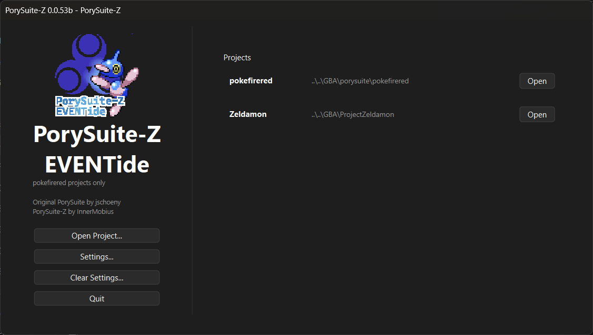

---

## Editor Pages

PorySuite-Z has 19 toolbar pages accessible from the RPG Maker XP-style icon toolbar:

### Pokemon

Full species editor with three sub-tabs:

- **Info** -- Species name, Dex number, category, description, types, abilities (including hidden), held items, gender ratio, egg groups/cycles, catch rate, friendship, growth rate, EXP yield, flags (Legendary, Mythical, etc.) with front sprite and animated icon preview
- **Stats** -- Base stats (HP/ATK/DEF/SP.ATK/SP.DEF/SPEED) and EV yields
- **Graphics** -- Battle scene preview (front/back sprites over background with shadow), Player Y/Enemy Y/Enemy Altitude, Normal and Shiny palette editors (16-swatch rows with color picker AND **drag-to-reorder** — drop on the leftmost slot to choose which color is transparent; the front/back PNGs are reindexed automatically on save), Import Palette from PNG, **Import .pal File**, Menu Icon with animated preview and palette index selector, footprint preview, Open Graphics Folder

Evolution chain editor with species, method, and parameter fields. Play Cry button for audio preview.

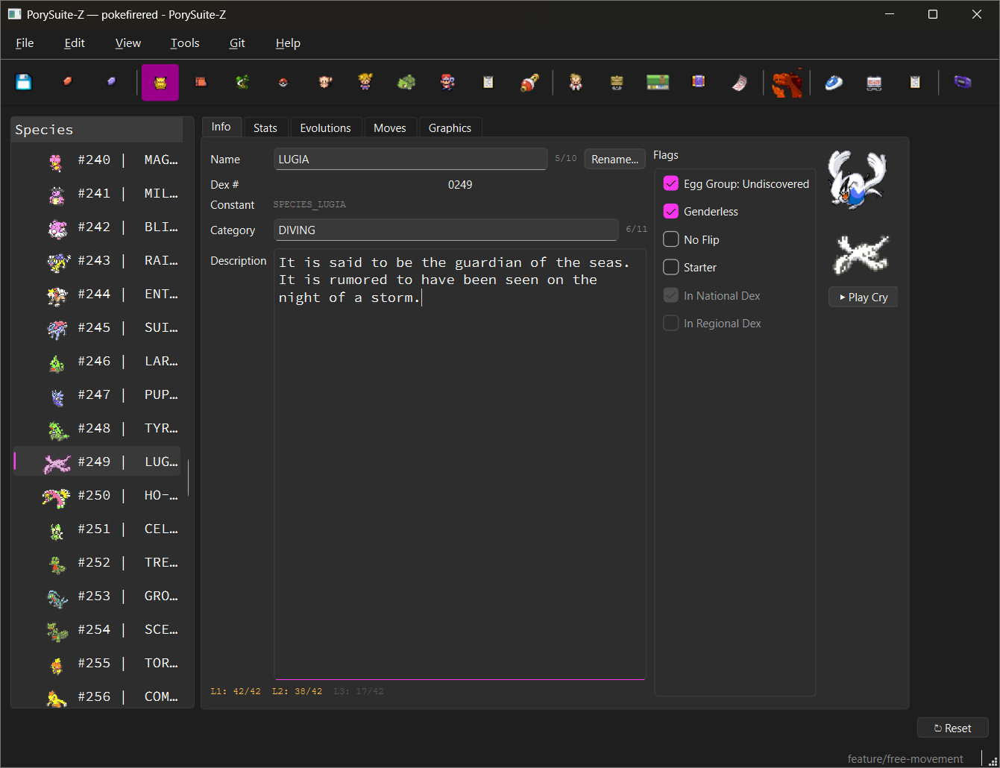


### Pokedex

National and Regional Dex editors. Add, remove, and reorder entries. Each entry shows a detail panel with classification, height/weight, description, and a size comparison preview (Pokemon sprite overlaid on trainer sprite). **Wild Encounters card** showing where each species can be found — method type (Grass, Water, Fishing, Rock Smash) with color-coded dots, friendly map names, and level ranges. Data parsed from `wild_encounters.json` with multi-floor merging and fishing rod sub-groups. Play Cry button.

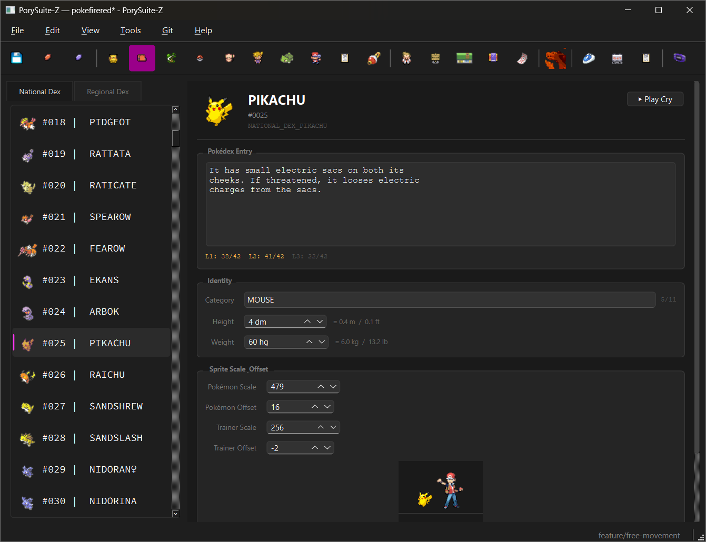

### Moves

Searchable and filterable move list. Detail editor includes: display name, power, accuracy, PP, type (color-coded), category (Physical/Special/Status with Gen 3 auto-calculation), target, effect description with per-line character limits (42 chars x 3 lines), and move flags.

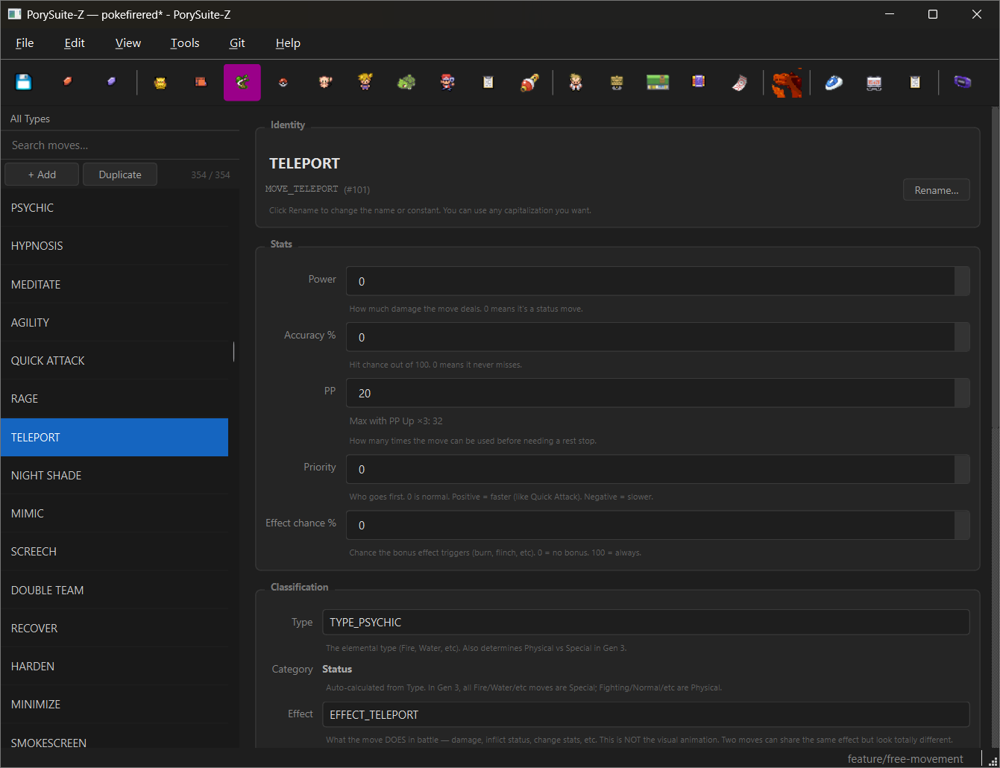

### Items

Searchable item list with a detail editor for each entry: constant name, display name, price, pocket type, item type, hold effect, field/battle use functions, description, and auto-resolved icon previews. Includes an **editable icon picker** -- change which sprite an item displays by picking from a dropdown of all available icons with thumbnails. Changes are saved to `item_icon_table.h`. An **"Open Icon in Folder"** button opens the current icon's PNG in your OS file manager for easy editing.

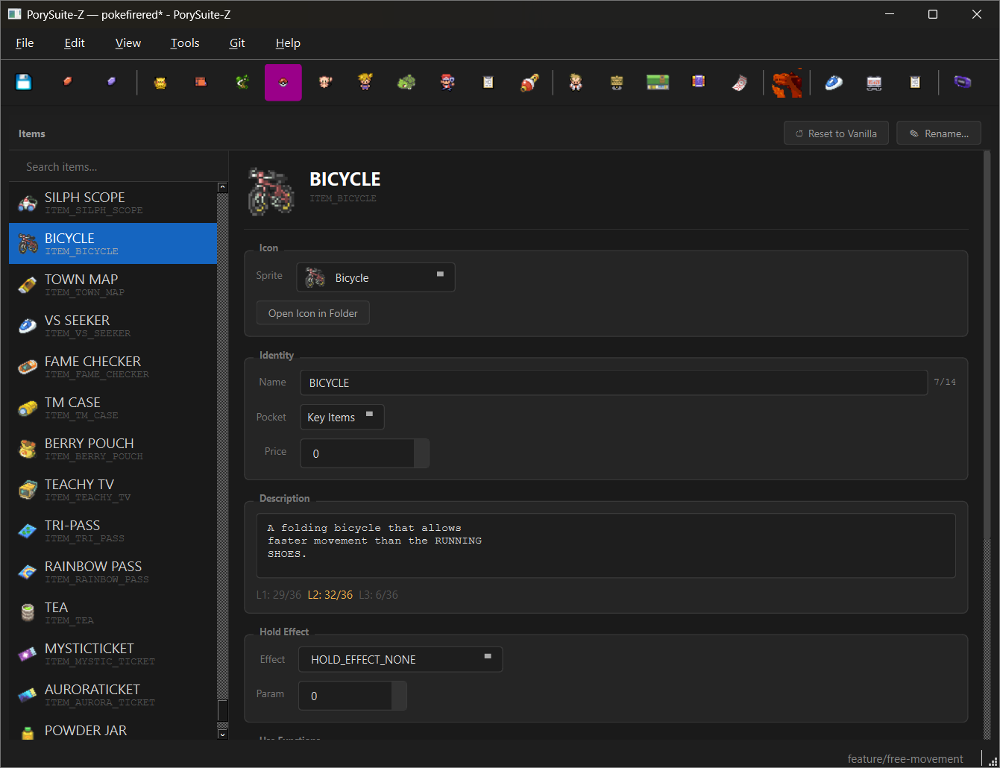

### Abilities

Searchable ability browser with detail panel:

- Display name (12-char limit with counter), constant name (read-only, renamed via Rename button), description (52-char limit with overflow highlighting)
- **Visual Battle Effect Editor** -- Pick a category (Status Immunity, Contact Status, Type Absorb, Weather, Stat Boost, Intimidate, Contact Recoil, Pinch Type Boost, Type Immunity, Weather Recovery, Type Trap, Crit Prevention) and configure parameters. Shows live C code preview. Writes real C code to the correct source files on save.
- **Visual Field Effect Editor** -- Pick a category (Encounter Rate, Type Encounters, Pickup, Guaranteed Escape, Faster Hatching, Nature Sync, Gender Attract) and configure parameters.
- Species usage table with double-click cross-navigation to Pokemon tab
- Add, duplicate, rename, and delete abilities

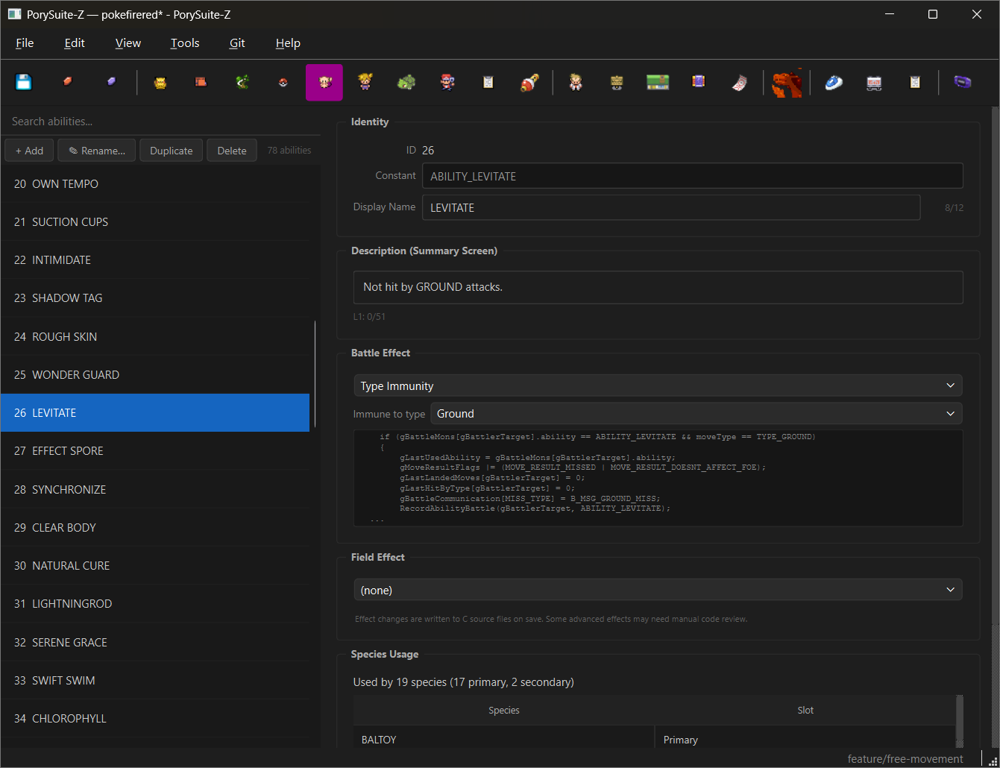

### Trainers

Four sub-tabs:

- **Trainers** -- Searchable trainer list grouped by trainer class. Detail editor includes: class, name, trainer pic (with visual preview), encounter music, AI flags, party type, and a full party editor with per-member level, species, held item, moves, and ability. VS Seeker rematch tier support with dynamic tier labels that refresh in-place when you edit a rematch party.
- **Trainer Classes** -- Searchable class list with sprite thumbnails. Edit class display name (12-character limit), prize money multiplier, and default sprite (dropdown with thumbnails of all trainer pics). **Rename...** button writes the new `TRAINER_CLASS_*` constant across source files (opponents.h, trainers.h, battle_main.c, trainer_class_names.h, data/trainers.json, scripts, maps). Create new classes with a button that writes to three files. View battle info, encounter music, facility class mappings, and usage counts. Inline note under the class-level Trainer Pic explains it's scoped to Battle Tower / Trainer Tower / Union Room facility battles only.
- **Graphics** -- Scrollable card grid of every trainer pic (thumbnail + name + `TRAINER_PIC_*` constant) with a live search filter, amber border on unsaved cards, and blue border on the selected card. Right panel has a 192x192 sprite preview, the same drag-to-reorder 16-swatch palette row used on Pokemon Graphics (drop on the leftmost slot to pick the transparent index — the sprite PNG is reindexed automatically on save), **Import PNG as Sprite...** (replaces pixels AND palette), **Import Palette from PNG**, **Import .pal File**, **Save Sprite as PNG**, **Save Palette as .pal**, and **Open Palettes Folder**. The **Add Trainer Pic** button takes a name and a PNG and registers a brand-new trainer pic across all four engine source files in one operation — the new constant is immediately available in the trainer detail panel and the trainer-class default-sprite dropdown without a restart. The body uses a draggable splitter so the grid and editor can be rebalanced, and both panels stay visible when the window isn't maximized.
- **Back Sprites** -- Dedicated editor for trainer **back** sprites (the throwing pose shown when a trainer sends out a Pokemon). Same PNG-import and drag-to-reorder palette toolkit as the front Graphics tab, plus the animated throwing sequence previewed with a play button and frame scrubber. **Add Back Sprite** registers a brand-new back sprite (name + PNG) across the engine source files in one operation.

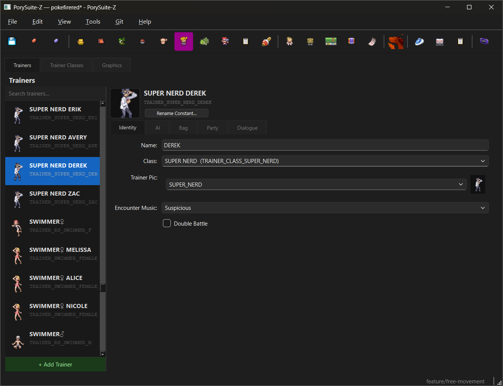

### Starters

Configure the three starter Pokemon. Each slot shows a front sprite preview (updates live when you change species) with type badges, plus: species, level, held item, custom move (optional), **Shiny Chance** (0–100%, generates a personality-based shiny guarantee without touching nature), and **Pokéball** (choose which ball the starter is given in; Game Default leaves the engine's default intact).

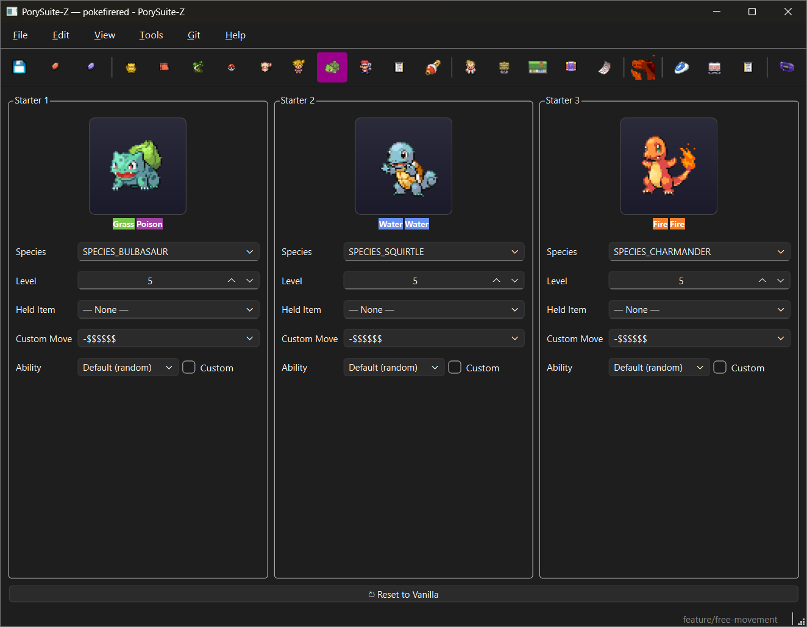

### Overworld GFX

Sprite-first overworld editor with two sub-tabs:

**NPC Sprites:**
- **Left panel** -- Category filter, search bar, scrollable thumbnail grid of all sprites, "+ Add New Sprite..." button, Dynamic OW Palettes (DOWP) controls
- **Right panel** -- Sprite sheet view with animation-type-aware preview (walk cycles, surf, fishing, VS Seeker, inanimate, destroy sequences), palette editor with "Assign to" dropdown for palette reassignment, Import from PNG, "Show in Folder"
- **Add New Sprite** -- Dialog auto-detects frame size/name/palette from PNG, writes all 6 C headers automatically, pushes new constant to EVENTide immediately
- **Frame Cycle** -- Turn any sprite into a stationary animated entity (paintings, torches, idle props) that cycles its sheet frames with no horizontal flipping. Two order modes: **Sequential** (frames loop 0→N in order, single uniform per-frame hold) or **Random** (frames cycle in a shuffled non-stuttering sequence with each frame getting its own random hold within a fastest/slowest range, so the cycle speeds up and slows down like vanilla idle NPCs). Adds a dedicated `MOVEMENT_TYPE_FRAME_CYCLE` engine movement type via the patcher the first time you press the button; place the entity in Porymap with that movement type and it free-runs forever regardless of conversations.
- **DOWP** -- Enable per-sprite palettes (patches 5 C source files). A risk scanner checks for null-palette sprites and warns if the project is near the 16-slot hardware limit before applying. R/G/B tint sliders control the water-reflection palette with a live preview. A red "Disable" button appears when DOWP is active and fully reverses the patch.

**Field Effect Sprites:**
Browse and edit the engine's in-world feedback sprites (exclamation marks, music notes, emoticons, egg hatch, confetti, etc.) from `graphics/field_effects/` and `graphics/misc/`. Same palette-editing toolkit as NPC sprites — drag-to-reorder swatches, Index as Background, import/export. Saving writes a `.pal` file when one exists, or bakes directly into the PNG when it doesn't. **Re-bake from Palette Tag** scans the project for the active Pokemon's or NPC's palette and rebakes the field effect's PNG against it — useful when an effect should inherit the colors of whatever sprite it's overlaying instead of carrying its own palette.

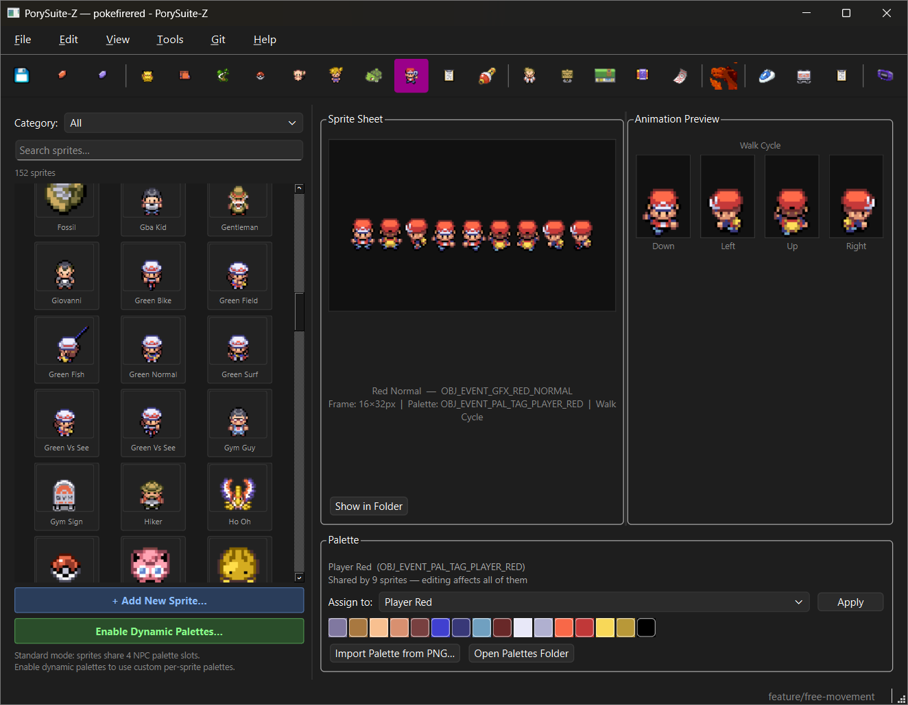

### Battle Animations

Editor for the GBA battle move/effect animations, with two sub-tabs:

**Sprites:**
- Browse every battle-animation sprite (the effect graphics moves draw — beams, orbs, impacts, status icons) in a searchable thumbnail grid.
- Frame preview plus the same drag-to-reorder 16-swatch palette editor used across the app (drop on the leftmost slot to choose the transparent index; the sprite is reindexed on save). Import/export, amber dirty markers, and every edit routed through the shared sprite-palette bus so other tabs stay in sync.

**Move Animations:**
- Pick any move and see its animation **script timeline** -- the real `createsprite` / sound / `delay` / task / background opcodes the engine runs, decoded into a readable, **editable** list. Add, insert, delete, and reorder commands, with per-opcode edit dialogs (a sprite-picker for `createsprite`, a sound picker for SFX, generic fields for the rest).
- **Frame-accurate preview** -- rather than approximating, PorySuite-Z runs the *actual* pokefirered battle-animation engine (compiled to WebAssembly and driven by the project's own sprite and palette data) and renders its OAM output frame by frame. A scrubber steps through the animation and the layered composite shows every active sprite at the selected frame. Covers move animations plus the status / general / special tables, on-mon effects (Dig, Fly, Bulk Up, Acid Armor's distortion, Role Play's silhouette), and full-screen background moves (Surf). If the WebAssembly runtime isn't installed the tab degrades gracefully -- the Setup Wizard offers to add it.

### Credits

Visual credits editor. Edit the scrolling end credits text with line-by-line character limits and color coding, with a live in-game preview panel.

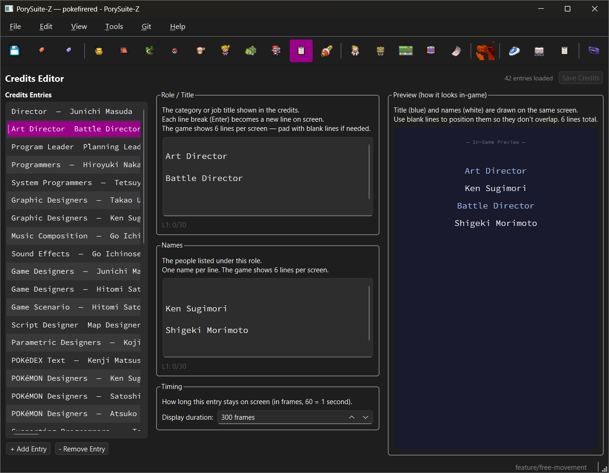

### Sound Editor

Full GBA M4A sound engine built in Python. Four sub-tabs:

> **Note:** The Sound Editor reads `.s` assembly files from `sound/songs/midi/`. These are build artifacts generated by `mid2agb` during compilation -- they don't exist until the project is built at least once. If the song list shows "Build required", run **Project > Make** (Ctrl+M) first, then reopen the Sound Editor.

- **Songs** -- Browse, filter, and play all songs. Tempo, reverb, and master volume are editable directly on the songs list — no need to open the piano roll. Right-click context menu: Rename, Replace with .s File, Export .s File, Delete. Import MIDI and Import .s buttons. Shows "Build required" when `.s` files are missing (e.g. after a fresh git pull).
- **Instruments** -- 144 unique instruments grouped by type (Samples, Square Waves, Prog. Waves, Noise, Keysplits). Editable ADSR with visual curve, base key, pan, duty cycle. 3-octave piano keyboard preview with hold-to-sustain. Sample management: export/import WAV (with rate/size picker), replace, delete with reference checking. Loop toggle and loop point editor with draggable waveform visualization. `.psinst` instrument preset export/import (zip with JSON manifest + sample data).
- **Voicegroups** -- Browse all voicegroups with slot counts and song usage. Full 128-slot editor. Add, clone, delete. Generate GM button creates a General MIDI voicegroup mapped to real instruments (with drum kit support). Friendly label system with auto-label from song usage.
- **Piano Roll** -- Full note editor with real-time GBA-accurate sequencer playback. Double-click to place notes, drag to move/resize, box selection, copy/paste, Ctrl+Z undo. Track sidebar with volume/pan/mute/solo per track. Song Structure panel showing sections, loops, and patterns. Snap grid (1/4, 1/8, 1/16, 1/32, free). Right-click note → Edit Note Properties (BEND/VOL/PAN control events). Scroll wheel = horizontal scroll, Ctrl+wheel = zoom, middle-click drag = zoom. **Flatten Dynamics** lists and removes hidden mid-song control envelopes (the volume / tempo / vibrato dips a note-only roll can't show) so a song plays at a constant volume and tempo. Save writes .s file directly with round-trip fidelity.

**MIDI Import Wizard** -- 5-page flow: file picker with track preview, voicegroup + settings, per-track instrument mapping (GM to VG slot with auto-match and named dropdowns), song structure sequencer (define sections, arrange play order, set loop point with presets), conversion + registration. Handles Type 0 MIDIs (auto-splits to per-channel tracks).

The track step is **honest about GBA voice limits**. It analyzes the song's *peak simultaneous notes* (not just track count) and shows a live meter against the project's real PCM voice budget (read from the M4A SoundInfo), the 4 PSG channels, and the 16-track cap. Every track gets an import checkbox and a PCM/PSG voice assignment; duplicate instruments can be **merged** onto one track; chords can be flattened to the top note or split into voices (with the voice cost shown live); and a MIDI that exceeds the budget raises a blocking-but-acknowledgeable warning so you trim or offload to PSG rather than silently importing a song that plays with stolen voices. Unchecking and merging actually reshape the imported song, not just the meter.

**Import .s File** -- Import songs from other projects. 3-page wizard with voicegroup compatibility check, automatic label rewrite, and registration.


### EVENTide

RMXP-style visual script editor. Key features:
- All event types (NPCs, triggers, signs, hidden items, map scripts) with numbered condition pages
- Hidden item editor -- dedicated property panel for data-only hidden items (no script needed)
- RMXP-style color scheme (customizable via Settings > Event Colors), conditions box, Set Move Route editor with 6 category tabs
- Position overrides from OnTransition scripts, cross-reference links, Set Flag → Page linking
- Script Lookup (Ctrl+Shift+F) -- project-wide search across 5,300+ labels
- 84+ command widgets, drag-to-reorder, right-click context menu, Go To navigation
- Go To button in command edit dialogs -- double-click a call/goto/conditional and navigate directly to the target script
- Plain English display names for all constants (flags, vars, weather, sounds, fade types)
- Move Camera cutscene tool -- pan, slide, screen effects, weather, sound, timing in one 6-tab dialog
- Sound preview buttons on playbgm/playse/playfanfare commands (plays in background without switching tabs), with "Open in Sound Editor" button
- Script templates (NPC, Sign, Map Script, Standard Wrapper, Field Object)
- Comprehensive tooltips on all controls, command dialogs, and command selector palette (toggleable in Settings)

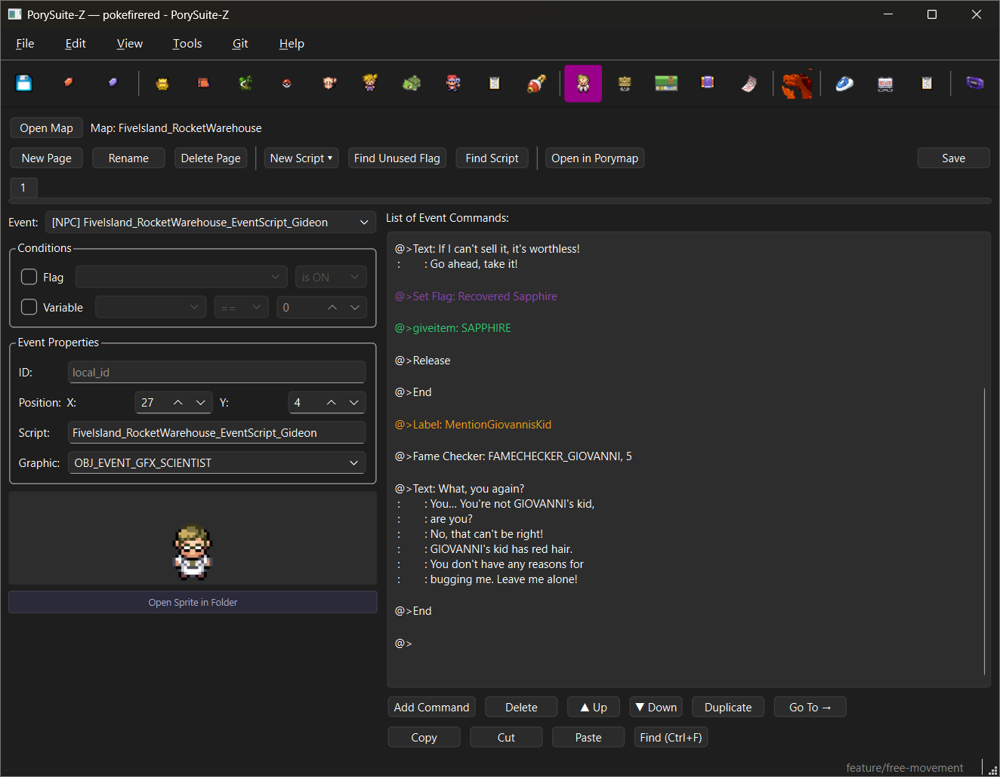

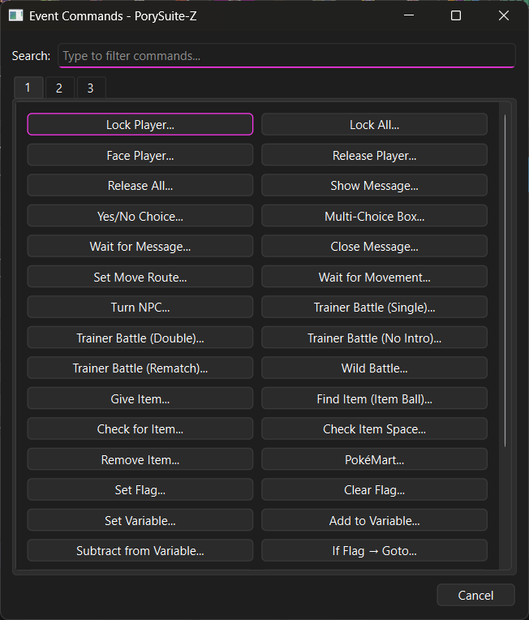

### Maps

Map and layout management with two sub-tabs:

- **Map Manager** -- Map tree with rename, group management, section renaming, move/delete maps, warp validation
- **Layouts & Tilesets** -- Layout renaming/deletion, orphan cleanup, tileset reassignment, secondary tileset renaming


### Region Map

Visual region map editor with actual tileset graphics as background. Click a cell, pick a MAPSEC from the strict dropdown, and the assignment stages immediately (cell turns amber until you save). Hover line under the map shows `(x, y)  MAPSEC_NAME` live as the cursor moves.

**Region management — staged in memory, flushed on Ctrl+S:**

- **Create New Region** — fresh blank region (empty MAPSEC grid, blank tilemap). Best for "I want a new dungeon / area to paint from scratch."
- **Clone Region** — copies the source region's tilemap **artwork** under a new name. The MAPSEC grid starts blank — you paint which MAPSECs the new region should own. Two regions can't both claim the same MAPSEC (the engine routes to whichever slot comes later in the enum), so the clone deliberately avoids duplicating the grid.
- **Rename Region** — renames the folder, files, and engine constant. Scans the project for external references to the old `REGIONMAP_<NAME>` constant and warns if the build will fail (so you can update them first).
- **Delete Region** — removes the region everywhere. Same external-reference scan as rename. Refuses to delete the last remaining region. Lists in plain English exactly what'll be removed (layout file, .bin, enum entry, lookup entries, visibility gates) before you confirm.

**Engine codegen** — `src/region_map.c` is rewritten between `// PORYSUITE-REGIONS-START / END` markers on every save with region changes. Eight blocks managed: enum, INCBINs, includes, decompress dispatch, player-region lookup table, player-region detect, get_section dispatch, story-flag visibility gates. First-time edit warning fires before the first staging op so you can back up to git first. Atomic write via temp + rename — no `.bak` files.

**Live name sanitizer** — typing `Hyrule Overworld` becomes `hyrule_overworld` as you type. Reserved C keywords, name collisions, and invalid characters are blocked.

**Open in Tilemap Editor** button jumps to the Tilemap Editor with the current region's `.bin`, `.png`, and `.gbapal` pre-loaded.


### Label Manager

Standalone toolbar page for managing constant labels. Add friendly names and notes to flags, vars, and other constants. Labels stored in `porysuite_labels.json`.


### Tilesets (Tilemap Editor)

GBA `.bin` tilemap viewer and editor with four sub-tabs:

**Tilemap Editor:**

- **Open any tilemap** from `graphics/` -- auto-discovers matching tile sheet (`.png`) and palettes (`.pal` AND `.gbapal` files). File dialog remembers the last folder you opened from within a session.
- **4bpp and 8bpp support** -- auto-detects color depth from PNG color table size. Title screen logos and other 256-color tilemaps render correctly.
- **Multi-palette 8bpp support (region-map style)** -- when an 8bpp PNG ships alongside a multi-palette `.gbapal` (multiple sub-palettes baked into one 256-color image — like `region_map.gbapal`), the canvas renders in GBA-accurate mode using the per-tile attr palette so what you see matches what the GBA draws. Picking a tile from the picker auto-detects which sub-palette it was baked from and sets the Pal spinner accordingly.
- **Auto-Fix Palettes button** -- bulk-repair pass that scans every tile in the current tilemap and rewrites stored palette bits to match the dominant 16-color range in the tile artwork. Useful after upgrading PorySuite-Z if a tilemap was saved before the multi-palette fix and now renders with wrong colors. One undo step.
- **Rendered preview** with correct palettes, tile flips, and zoom (1-8x) with grid overlay
- **Paint tool** -- click/drag tiles from the tile picker onto the tilemap
- **Eyedropper tool** -- right-click any tile on the canvas to instantly pick it (sets tile index, palette, hflip, vflip). Left-click pick-tool mode also works.
- **Multi-tile stamp** -- shift+right-click+drag in the canvas OR in the tile sheet picker grabs a rectangular region as the active stamp. Left-click then stamps the entire pattern at each click position, preserving each cell's tile index, flips, and palette. A badge in the toolbar reads `Stamp: 1×1` normally and `Stamp: W×H` in amber when a multi-tile region is active. A faint dashed outline under the cursor on the canvas shows where the stamp will land. Single-tile picks (left-click in picker, plain right-click eyedrop on canvas, palette/H-flip/V-flip toggle) reset the stamp back to 1×1.
- **Flood fill** -- middle-mouse-click on a canvas cell to flood-fill the 4-connected region of cells whose `(tile_index, hflip, vflip, palette)` all match the clicked cell with the current single tile. Multi-tile stamps don't tile-pattern the fill — fill always uses the single-tile state. One undo step regardless of region size.
- **Undo/Redo** -- Ctrl+Z / Ctrl+Y (also Ctrl+Shift+Z). A drag-paint counts as ONE undo step regardless of how many cells you swept across. Flood fill is one step. 100-step history.
- **Per-tile controls** -- palette slot, horizontal/vertical flip
- **Tile offset** -- VRAM base address spinner (0-1023) for games that load tile sheets at non-zero offsets
- **Dimension re-wrap** -- changing width auto-recalculates height to keep all tilemap entries (never truncates)
- **Visual palette editor** -- 16 palette slots shown as color swatch rows. **Double-click any color swatch to edit it** with a color picker (GBA 15-bit clamped). Right-click for Import .pal (JASC format), Export .pal, Extract from PNG, Export All. Color-coded slot labels: white = loaded & used, red = needed & missing, grey = loaded & unused
- **Smart palette loading** -- name-matching `.pal` / `.gbapal` files auto-load (e.g. `solarbeam.bin` → `solarbeam.pal`). Falls back to a single multi-palette file in the same dir when no name match exists (the canonical "shared palette across many tilemaps" case, like `region_map.gbapal` for every `<region>.bin`).
- **Open in Folder** (next to Save) reveals the current `.bin` tilemap in your OS file manager. **Open Sheet** (next to the Tile Sheet combo) reveals the currently-selected tile sheet `.png` so you can edit it in an external image editor (GIMP, Aseprite, etc.). When you save the tilemap, the editor broadcasts a `file_saved` signal app-wide, so dependent views (like the Region Map tab) refresh automatically.
- **Palette source toggle** -- "Auto .pal files" (loads from project's palette directory) or "PNG colors" (uses tile sheet's own color table)
- **Save** -- integrated with the app's File > Save pipeline. Tile changes mark the window dirty; saving writes the `.bin` file alongside all other editors.


**Tile Animation Editor:**

AnimEdit-style tile animation editor covering **all three GBA animation systems** -- 77 animations in vanilla pokefirered, all discovered dynamically from source with no hardcoded names:

- **Navigate by Tileset + Animation Number** -- 68 tilesets parsed from `headers.h`, animated tilesets sorted first. Animations indexed ("0: Flower", "1: Water"). Works on any pokefirered project.
- **All properties editable** -- Speed/Divisor, Start Tile (hex, 0x1A0 matching Porymap), Tile Amount, Phase, Counter Max. Changes follow the app's normal save pipeline (mark dirty, File > Save writes to tileset_anims.c).
- **Palette integration** -- loads all 16 tileset .pal files with GBA 15-bit clamping. Editable color swatches, palette slot selector (00-15), import/export .pal. Palettes are shared with Porymap.
- **Add New Animation** (+) -- creates brand new tileset animation with full C source wiring: INCBIN, frame array, QueueAnimTiles, dispatch, Init, headers.h callback registration.
- **Remove Animation** (-) -- cleanly strips all C source references.
- **Preview controls** -- zoom dropdown (1x through 16x), 16x16 metatile checkbox (keeps 2x2 tile blocks together during wrapping), W/H tile layout controls for wrapping wide animations into a grid. Collapsible Frame Thumbnails and Tile Grid sections that collapse to zero height, giving more room to the preview.
- **Frame Scrubber** -- prev/slider/next for manual stepping through animation frames.
- **Tile Grid** -- current frame decomposed into 8x8 tiles with hex VRAM addresses and base tile display. Toggle between grid and horizontal strip layout.
- **Fixed-panel layout** -- 310px left panel (navigation, properties, palette) + stretching right panel (preview, filmstrip, tile grid). No splitter gap.
- **Animated preview** with speed slider, filmstrip thumbnail strip, info panel.
- **Tileset BG Animations (8)** -- full editing of all properties + frame add/delete/replace.
- **Door Animations (32)** / **Field Effect Animations (37)** -- read-only frame display, open spritesheet in Explorer.


**GBA Image Indexer:**

Convert any PNG image to GBA-compatible indexed format:

- **Load any PNG** (RGB, RGBA, or already-indexed) -- shows original preview with dimensions, mode, and color count
- **Quantize to 16 or 256 colors** -- 4bpp for sprites/tiles, 8bpp for backgrounds. All output colors clamped to GBA 15-bit BGR555 (multiples of 8)
- **4 quantize modes** -- Balanced (fair to small details, default), Smooth Gradients (preserves subtle shading), Preserve Rare Colors (keeps unique colors even if they cover few pixels), Manual Pick (choose which colors to keep from ~24 candidates with a live preview)
- **Floyd-Steinberg dithering** -- optional, creates smoother gradients. Turn off for pixel-art style. Never forced by any mode
- **Orphan pixel cleanup** -- when dithering is off, a 3×3 majority filter removes scattered single-pixel noise from nearest-color mapping while preserving real edges and detail
- **Drag-and-drop palette reordering** -- drag any swatch to reorder. Drop onto index 0 to set the background/transparent color. All pixel indices remapped automatically
- **Click to edit colors** -- click any swatch to open a color picker (output GBA-clamped)
- **Show Transparent toggle** -- view index 0 as transparent or as its actual color
- **Trim Unused Colors** -- compact 256-color palettes by removing unused and duplicate entries
- **Closest-color remapping** -- load an existing `.pal` file and force the image to use only those exact colors, with optional dithering on remap
- **Convert to Tilemap** -- split the indexed image into 8×8 tiles, deduplicate (including H/V flipped copies), export a `.bin` tilemap + tile sheet PNG + `.pal` file
- **RGBA transparency** -- transparent pixels auto-assigned to index 0
- **Export** -- save indexed PNG, JASC `.pal`, or both to the same folder. Compatible with Porymap, GRIT, and other GBA tools


**Palette Baker:**

Manual tool for rewriting an indexed PNG's embedded color table to match a separately-loaded palette file. Pixel indices are NEVER changed — only the color table is replaced. Use case: a PNG whose baked colors have drifted from the canonical palette (typical when one palette is shared across many PNGs that don't all live in tabs that own the palette — HUD elements, item icons, shared NPC palettes).

- **Load PNG** + **Load Palette** — pick the indexed PNG and the `.pal` (JASC) or `.gbapal` (binary) you want to bake into it. Each independently loaded.
- **Side-by-side preview** — left pane shows the PNG with its current embedded color table; right pane shows it with the loaded palette applied. Immediate visual diff.
- **Per-slot stale highlighting** — palette-to-apply swatch row gets an amber border on every slot that differs from the currently-baked palette. Tells you at a glance how drifted the file is.
- **Editable swatch row** — click any swatch in the "palette to apply" row for a color picker (GBA 15-bit clamped). Drag-reorder is supported; drop on slot 0 to set as background/transparent.
- **Save** — overwrites the loaded PNG in place with the new color table. Byte-equality guarded (a no-op bake doesn't touch the file). Pushes to the sprite-palette bus on save so other tabs invalidate their sprite caches without an F5.
- **Bake to other PNGs…** — once a palette is loaded, this opens a multi-select file picker so you can apply the same palette to any number of PNGs you choose in one operation. User-driven; no auto-resolution. Right primitive for the "one .pal shared by many PNGs" case.
- **`.gbapal` support** — multi-palette binary `.gbapal` files are read directly (each pair of bytes is a 5-bit-per-channel BGR555 color), so region-map-style multi-sub-palette files load without conversion.

This tab is intentionally manual — there's no project-wide scanner. pokefirered has many `.pal` files whose same-name PNG doesn't actually use them (battle anims get palettes at runtime from C code, intro scenes have palettes hardcoded, etc.), so automatic PNG↔palette resolution can't be reliable. You name the pair; the tab does the safe bake.

### Text Editor

Project-wide text browser, editor, and search & replace for all game-visible strings.

- **Tree browser** with 11 collapsible categories: Game UI & Menus, New Game Intro, Location Names, Map Dialogue, Common Scripts, Battle Messages, Teachy TV, Fame Checker, Quest Log, Trainer Class Names, Nature Names
- **Search bar** at the top with match case, whole word, and regex options. Results grouped by category with counts
- **Replace bar** (toggled) -- Replace Selected or Replace All in Results
- **Editor panel** -- GameTextEdit with context-appropriate character limits, file/label header, script cross-references
- **Formatting toolbar** sits above every text field. Two rows: colour buttons (Red / Blue / Green plus a More… picker for the full named-colour set) apply to the selected text without leaving visible `{COLOR}` markup in the editor; the symbol row inserts PK / PKMN / LV / ¥ / ♂ / ♀ / arrows; submenus cover GBA button glyphs (A, B, L, R, Start, Select, D-Pad), the engine's emoji set (Heart, Fire, Note, faces, etc. — shown as real Unicode glyphs), variables (`{PLAYER}`, `{RIVAL}`, `{STR_VAR_*}`), and pacing tokens (`{PAUSE}`, `{PAUSE_UNTIL_PRESS}`, music pause/resume). Same toolbar appears wherever text is edited — item / move / ability / dex descriptions, trainer dialogue, EVENTide messages, credits.
- **Braille render mode** -- EVENTide message dialogs gain a render-mode dropdown next to the text field. Picking *Braille* switches the editor to a sepia background and disables every non-Braille toolbar button, then writes the message via the `.braille` directive and `braillemessage` script command. Round-trips cleanly with the existing `.string` / `msgbox` form.
- **"Open in EVENTide"** button for map dialogue and common script entries -- switches to EVENTide, loads the map, and selects the exact NPC whose script contains that text (searches the full command tree, works regardless of script chain depth)
- **Saved searches** persist across sessions in `porysuite_text_bookmarks.json`. Right-click to rename/delete groups and manage entries
- All parsers are dynamic -- whatever maps, scripts, and text files exist in your project are shown


### Diagnostics

ROM build diagnostics dashboard. Shows ROM size (progress bars for 16MB and 32MB limits), EWRAM usage (256 KB) and IWRAM usage (32 KB) with color-coded progress bars (green/amber/red), section breakdown (.text, .rodata, .data, .bss from ELF), build type (modern vs legacy), and song/map/species counts. Parses .map and .elf files. Helps catch memory overflows before they become runtime crashes.


### Config

Edit build configuration (`config.mk`) and game defines (`include/config.h`). Makefile variables and C preprocessor `#define` values are organized into collapsible section cards with toggle support.

Beyond the standard build flags, the Config tab also exposes new-game setup and a few engine-level tunables that are otherwise buried in source:

- **New Game setup** -- Starting money, starting location (map + X/Y coordinates), whether the National Dex is unlocked from the start, the player's starting bag items and PC items, and the default **Text Speed** and **Battle Style** -- written into `new_game.c` / `player_pc.c` so a fresh save begins exactly as configured.
- **Run Indoors** -- Let the player run inside buildings (vanilla pokefirered disables it). Reversible.
- **Trainer Prize Base Multiplier** -- changes the base scalar used for trainer prize money. Custom-economy projects no longer need to hand-edit `battle_main.c` (and don't risk a regression from a `git pull` resetting it).
- **Gender-Tinted NPC Dialogue** -- vanilla pokefirered auto-tints NPC dialogue based on the talked-to NPC's overworld graphic (male sprites speak in blue, female sprites in red, neutral / object / Pokemon sprites stay dark gray). Toggle this off in projects that don't want the tint. The patch is idempotent and reversible — flipping it back on restores the canonical vanilla function.

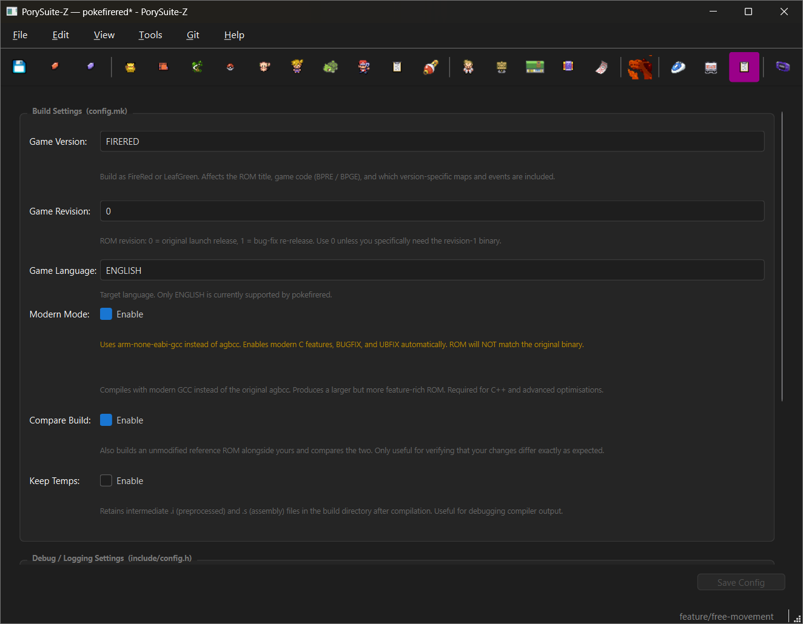

---

## Menus

### File

| Action | Shortcut |
|--------|----------|
| Open Project | Ctrl+O |
| Recent Projects | -- |
| Save (with confirmation) | Ctrl+S |

### Edit

| Action | Description |
|--------|-------------|
| Name Decapitalizer | Batch-convert ALL-CAPS names to Smart Title Case across 7 categories (species, moves, items, trainers, trainer classes, abilities, UI strings). Preview table, editable skip-list, per-row control. |

### View

| Action | Description |
|--------|-------------|
| (Editor pages) | Switch to any editor page (same as clicking toolbar icons) |
| Show Log Panel | Toggle the developer log panel at the bottom of the window (hidden by default, persists across sessions) |

### Project

| Action | Shortcut |
|--------|----------|
| Export to Patch (.bps) | Ctrl+Shift+E |
| Make (Build ROM) | Ctrl+M |
| Make Modern | Ctrl+Shift+M |
| Play | F9 |

### Tools

| Action | Shortcut |
|--------|----------|
| Install Porymap | -- |
| Open in Porymap | Ctrl+F7 |
| Sound Editor | F8 |
| Open Terminal | Ctrl+T |
| Rename Species | -- |
| Open Crashlogs Folder | -- |
| Settings | -- |

### Git

| Action | Shortcut |
|--------|----------|
| Git Panel | Ctrl+Shift+G |
| Pull from Upstream | Ctrl+Shift+L |
| Push to Origin | Ctrl+Shift+U |
| Commit | Ctrl+Shift+K |
| Configure Remotes... | -- |

All git push and pull operations show a confirmation dialog warning about data that will be overwritten. These cannot be suppressed.

---

## Settings

Accessible from Tools > Settings:

- **General** -- Project display name
- **Advanced Diagnostics** -- Verbose internal logging for types/gender parsing (off by default)
- **Notifications** -- Re-enable previously suppressed dialogs
- **Build Environment** -- Open the Setup Wizard to install/verify build tools
- **Event Colors** -- Customize colors for constant types and command categories. Changes apply immediately.
- **EVENTide Tooltips** -- Toggle descriptive hover tooltips on/off (on by default)
- **Sound** -- Preview volume, loop count, auto-downsample rate, stereo/mono output mode

---

## Porymap Integration

PorySuite-Z integrates [Porymap](https://github.com/huderlem/porymap) as a companion visual map editor. Edit tiles and place events in Porymap, edit scripts and data in PorySuite-Z -- the two apps communicate bidirectionally.

### Setup

1. Go to **Tools > Install Porymap**
2. The installer clones the Porymap source, downloads the Qt SDK, applies PorySuite-Z patches, compiles, and deploys -- all automatically
3. Progress shows which file is being compiled so it doesn't appear hung

### Usage

- **Open in Porymap** (Ctrl+F7) -- opens Porymap to whatever map you're editing in PorySuite-Z
- If Porymap is already running, it switches to the requested map instead of opening a second window
- Clicking an event in Porymap updates PorySuite-Z's EVENTide to show that event's script
- Maps tab has right-click "Open in Porymap" context menus
- Shared file watchers detect when Porymap saves a map and offer to reload in PorySuite-Z

### Version tracking and updates

- **Check for Porymap Updates** (in Tools menu) queries the GitHub Releases API and compares against the installed version
- If Porymap is updated from within Porymap itself (its built-in updater), PorySuite detects that the patched binary was replaced and shows a warning on next project load
- The Tools menu changes to "⚠ Re-patch Porymap..." when patches are detected as missing
- Always update Porymap through PorySuite (Tools → Update Porymap) to keep bridge patches intact

### What gets patched

The installer adds event callbacks, a bridge API, and CLI argument handling to Porymap's scripting engine via `porymap_patches/apply_patches.py`. This is a search-and-replace patcher (not fragile git patches) that survives upstream Porymap updates. The patched binary lives in `porymap/` (not committed to git -- built locally).

---

## How Edits Are Saved

PorySuite-Z reads from and writes back to the original pokefirered source files:

- File > Save shows a confirmation dialog before writing
- Edits modify only the relevant fields in existing file structures (`.field = value` blocks, enum entries, etc.)
- Whitespace, comments, field order, and formatting are preserved
- **No phantom git diffs.** Every writer in the save pipeline is guarded by a byte-equality check — a file is only rewritten when its actual bytes would differ from what's already on disk. Combined with per-section snapshot guards that skip writers when their domain wasn't edited, a sound-only edit produces a sound-only diff. Earlier versions could dirty up to 19 unrelated files (species headers, learnsets, palettes, sprite PNGs) on a save that should have touched two assembly files.
- If a required source file is missing or the layout is ambiguous, the save aborts with an error and no files are changed
- Piano roll saves write the .s assembly file directly (not deferred to File > Save)
- Sound editor changes (voicegroups, song table) are written through the File > Save pipeline

---

## Build

Build your ROM directly from PorySuite:

- **Project > Make** (Ctrl+M) -- Standard build
- **Project > Make Modern** (Ctrl+Shift+M) -- Modern build variant
- **Project > Export to Patch** (Ctrl+Shift+E) -- Generate a `.bps` patch file
- **Project > Play** (F9) -- Launch the built ROM

Build output streams in real time in-app.

---

## Credits & Acknowledgements

- **Original PorySuite** by [jschoeny](https://github.com/jschoeny/PorySuite) — PorySuite-Z was originally forked from this project, but has been almost entirely rewritten. Very little of the original codebase remains.
- **PorySuite-Z** by [InnerMobius](https://github.com/InnerMobius)
- **Built with Claude** (Anthropic) — the vast majority of the code in this project was written by AI. The human developer directs architecture, tests features, files bugs, and makes all design decisions. Claude writes the code. Every commit in the git history that includes a `Co-Authored-By: Claude` line was AI-assisted.
- [Porymap](https://github.com/huderlem/porymap) by huderlem is a separate project and is **not included** in this repository. PorySuite-Z's optional installer clones and builds Porymap from its own GitHub repo on your machine. We do not distribute Porymap or any of its code.
